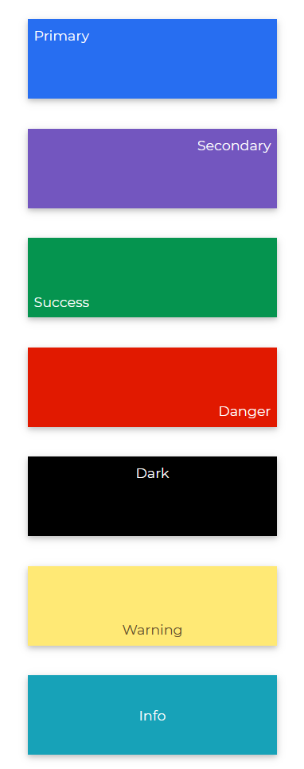
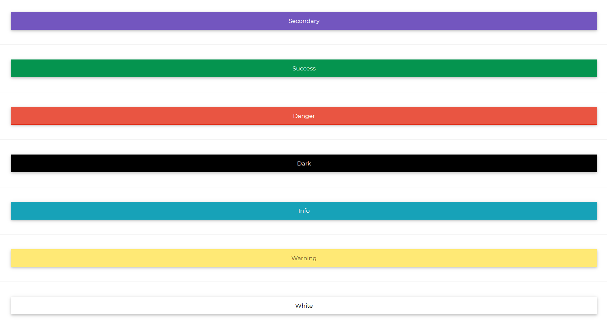

# Angular Bootstrap Button

Angular Bootstrap button allows users to interact with your website. They are easy to customize in terms of size, shape, and color. They include several predefined button styles, each serving its semantic purpose, with a few extras thrown in for more control.

## Importing the Contrast Angular Bootstrap Button Module

To use the Contrast Angular Bootstrap Button component in your project you need to import `ButtonModule`.

```typescript
import {ButtonModule } from 'cdbangular';
```

## Basic Button Styling

Use the `color` prop to give your buttons a background color.


###### html
```html
<CDBBtn color="primary">Primary</CDBBtn>
<CDBBtn color="secondary">Secondary</CDBBtn>
<CDBBtn color="success">Success</CDBBtn>
<CDBBtn color="danger">Danger</CDBBtn>
<CDBBtn color="dark">Dark</CDBBtn>
<CDBBtn color="warning">Warning</CDBBtn>
<CDBBtn color="info">Info</CDBBtn>
<CDBBtn color="white">White</CDBBtn>
<CDBBtn color="light">Light</CDBBtn>
```

## Circular Buttons

Set the [circle] prop to `true` to make your buttons more rounded


###### html
```html
<CDBBtn color="primary" [circle]=true>
    Primary
</CDBBtn>
<CDBBtn color="secondary" [circle]=true>
    Secondary
</CDBBtn>
<CDBBtn color="success" [circle]=true>
    Success
</CDBBtn>
<CDBBtn color="danger" [circle]=true>
    Danger
</CDBBtn>
<CDBBtn color="dark" [circle]=true>
    Dark
</CDBBtn>
<CDBBtn color="warning" [circle]=true>
    Warning
</CDBBtn>
<CDBBtn color="info" [circle]=true>
    Info
</CDBBtn>
<CDBBtn color="white" [circle]=true>
    White
</CDBBtn>
<CDBBtn color="light" [circle]=true>
    Light
</CDBBtn>
```
## Outline Buttons

Set the [outline] prop to `true` to have only the outline of the button colored.


###### html
```html
<CDBBtn color="primary" [outline]=true>
    Primary
</CDBBtn>
<CDBBtn color="secondary" [outline]=true>
    Secondary
</CDBBtn>
<CDBBtn color="success" [outline]=true>
    Success
</CDBBtn>
<CDBBtn color="danger" [outline]=true>
    Danger
</CDBBtn>
<CDBBtn color="dark" [outline]=true>
    Dark
</CDBBtn>
<CDBBtn color="warning" [outline]=true>
    Warning
</CDBBtn>
<CDBBtn color="info" [outline]=true>
    Info
</CDBBtn>
```

## Circular Outline Buttons


###### html
```html
<CDBBtn color="primary" [circle]=true [outline]=true>
    Primary
</CDBBtn>
<CDBBtn color="secondary" [circle]=true [outline]=true>
    Secondary
</CDBBtn>
<CDBBtn color="success" [circle]=true [outline]=true>
    Success
</CDBBtn>
<CDBBtn color="danger" [circle]=true [outline]=true>
    Danger
</CDBBtn>
<CDBBtn color="dark" [circle]=true [outline]=true>
    Dark
</CDBBtn>
<CDBBtn color="warning" [circle]=true [outline]=true>
    Warning
</CDBBtn>
<CDBBtn color="info" [circle]=true [outline]=true>
    Info
</CDBBtn>
```

## Flat Buttons

Use the [flat] buttons to remove the button shadow.


###### html
```html
<CDBBtn color="primary" [flat]=true>
    Primary
</CDBBtn>
<CDBBtn color="secondary" [flat]=true>
    Secondary
</CDBBtn>
<CDBBtn color="success" [flat]=true>
    Success
</CDBBtn>
<CDBBtn color="danger" [flat]=true>
    Danger
</CDBBtn>
<CDBBtn color="dark" [flat]=true>
    Dark
</CDBBtn>
<CDBBtn color="warning" [flat]=true>
    Warning
</CDBBtn>
<CDBBtn color="info" [flat]=true>
    Info
</CDBBtn>
<CDBBtn color="white" [flat]=true>
    White
</CDBBtn>
<CDBBtn color="light" [flat]=true>
    Light
</CDBBtn>
```
<i/>

## Label at the side

Use the `label` prop to define the position of your label.


###### html
```html
<CDBBtn color="primary" label="right">Primary</CDBBtn>
<CDBBtn color="secondary" label="right">Secondary</CDBBtn>
<CDBBtn color="success" label="right">Success</CDBBtn>
<CDBBtn color="danger">Danger</CDBBtn>
<CDBBtn color="dark" label="left">Dark</CDBBtn>
<CDBBtn color="warning" label="left">Warning</CDBBtn>
<CDBBtn color="info" label="left">Info</CDBBtn>
<CDBBtn color="white" label="left">White</CDBBtn>
<CDBBtn color="light" label="left">Light</CDBBtn>
```
<i/>

## Large Button ending with Text

Use the `endingText` to define where your text is positioned.



###### html
```html
<CDBBtn style="width: 250px; height: 80px" color="primary" endingText="top-left">Primary</CDBBtn>
<CDBBtn style="width: 250px; height: 80px" color="secondary" endingText="top-right">Secondary</CDBBtn>
<CDBBtn style="width: 250px; height: 80px" color="success" endingText="bottom-left">Success</CDBBtn>
<CDBBtn style="width: 250px; height: 80px" color="danger" endingText="bottom-right">Danger</CDBBtn>
<CDBBtn style="width: 250px; height: 80px" color="dark" endingText="top">Dark</CDBBtn>
<CDBBtn style="width: 250px; height: 80px" color="warning" endingText="bottom">Warning</CDBBtn>
<CDBBtn style="width: 250px; height: 80px" color="info" endingText="center">Info</CDBBtn>
<CDBBtn style="width: 250px; height: 80px" color="white" endingText="center">White</CDBBtn>
<CDBBtn style="width: 250px; height: 80px" color="light" endingText="center">Light</CDBBtn>
```

## Block Button

Set the [block] prop to true to make the button take the entire width.



###### html
```html
<CDBBtn color="primary" [block]=true>
    Primary
</CDBBtn>
<CDBBtn color="secondary" [block]=true>
    Secondary
</CDBBtn>
<CDBBtn color="success" [block]=true>
    Success
</CDBBtn>
<CDBBtn color="danger" [block]=true>
    Danger
</CDBBtn>
<CDBBtn color="dark" [block]=true>
    Dark
</CDBBtn>
<CDBBtn color="info" [block]=true>
    Info
</CDBBtn>
<CDBBtn color="warning" [block]=true>
    Warning
</CDBBtn>
<CDBBtn color="white" [block]=true>
    White
</CDBBtn>
<CDBBtn color="light" [block]=true>
    Light
</CDBBtn>
```
<i/>

## Buttons with Icons

Nest the [CDBIcon](https://www.devwares.com/docs/contrast/react/components/icon) in your `CDBBtn` to have icons in your buttons.


###### html
```html
<CDBBtn color="warning">
    <CDBIcon icon="magic" class="ml-1"></CDBIcon>
    Warning
</CDBBtn>
<CDBBtn color="info">
    Info
    <CDBIcon icon="magic" class="mr-1"></CDBIcon>
</CDBBtn>
```

## Button Sizes

Use the `size` prop to define how little or large you want your buttons to be.


###### html
```html
<CDBBtn color="primary" size="xl">Extra Large button</CDBBtn>
<CDBBtn color="secondary" size="large">Large button</CDBBtn>
<CDBBtn color="warning">Normal button</CDBBtn>
<CDBBtn color="success" size="small">Small button</CDBBtn>
```

## Disabled Buttons

Set the [disabled] prop to true to disable the button.


###### html
```html
<CDBBtn color="secondary" [disabled]=true>
    Disabled Button
</CDBBtn>
```


## API Reference: Contrast Angular Bootstrap Button Props

This section will build on your information about the props you get to use with the Contrast Angular Bootstrap Breadcrumb component. You will find out what these props do, their default values, and how you would use them in your code.

The table below lists other prop options of the `CDBBtn` component.

| Name            | Type        | Default      |   Description| Example      |
| :------------- | :----------: | -----------: | :----------: | -----------: |
| action         | Boolean      | false        | Adds `btn-action` class, works with Cards | action=true |
| active         | Boolean      | false        | Adds active class | active=true |
| block          | Boolean      | false        | Create block level buttons | block=true |
| circle         | Boolean      | false        | Adds `btn-circle` class, works with stepper | circle=true |
| class          | String       |              |                   | class="custom-class" |
| color          | String       | primary      | Determines button color, accepts CDB predefined color classes | color="secondary" |
| disabled       | Boolean      | false        | Disables button from being clicked | disabled=true |
| download       | String       |              | Adds download attribute with provided url | download="https://link_to_your_file.com" |
| endingText     | String       |              | Positions the button text in one of the selected positions. These positions include `top-left`, `top-right`, `bottom-left`, `bottom-right`, `top`, `bottom`, `center`.| endingText="center" |
| flat           | Boolean      | false        | Adds flat effect to button. That is button without background and borders | flat=true |
| innerRef       | function or String |        | Allows to pass Ref string, which will attach to rendered button or a DOM element | innerRef="buttonRef" |
| label          | String       |              | Positions button text `left` or `right`. | label="left" |
| onClick        | function     |              | Will call a function when the button is clicked | onClick={yourFunction} |
| role           | String       |              | Adds role attribute to button | role="...." |
| size           | String       | medium       | Determines button size, available values: `[small, large, xl]`. | size="large"   |
| social         | String       |              | Adds a social media icon. | social="fb" |
| target         | String       | _self        | If used as link, sets target attribute | href="..." target="_blank" |
| type           | String       | button       | Adds type attribute to button | type="submit" |
