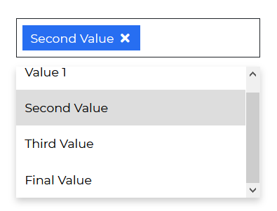

---
title: 'Multiselect'
metaTitle: 'Bootstrap 5 MultiSelect - Bootstrap CSS tutorial'
metaDescription: 'Bootstrap 5 Multiselect is one of Contrast components that allows you to control the numerous options available in one record. it is mostly used in forms, menus and surveys.'
---# Bootstrap 5 Multiselect

Bootstrap 5 Multiselect is one of Contrast components that allows you to control the numerous options available in one record. it is mostly used in forms, menus and surveys.

They let you to navigate through alternatives by using the `↑` and `↓` arrow keys, and to choose the required option by using the `↵` key.

<i/>

## Basic Multiselect

To use Contrast Bootstrap 5 Multiselect in your project, use the `multiselect` class.

The Multiselect method in the CDB targets the element with the `multiselect` class.

The `options` array represents the many values you are allowing the user to choose from, while the `multiple` prop accepts a boolean value that, when set to true, allows you to select more than one multiselect option. The `icon` prop specifies which icon should appear in your multiselect, and the `placeholder` specifies what data should be entered into the input field.



###### html

```html
<span class="multiselect"></span>
```

###### Script

```js
  <script src="../build/cdbbootstrap.js"></script>
  <script>
    var multiSelect1 = new CDB.MultiSelect('.multiselect', {
      options: [
        {
          label: 'New York',
          value: 'NY',
        },
        {
          label: 'Washington',
          value: 'WA',
        },
        {
          label: 'California',
          value: 'CA',
        },
        {
          label: 'New Jersey',
          value: 'NJ',
        },
        {
          label: 'North Carolina',
          value: 'NC',
        },
      ],
      multiple: true,
      icon: 'fa fa-times',
      placeholder: 'Select a State',
    });
  </script>
```
