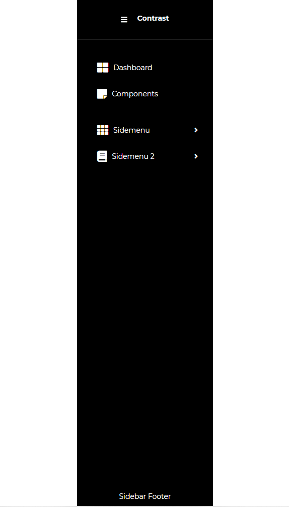

---
title: 'Sidebar'
metaTitle: 'Bootstrap 5 Sidebar'
metaDescription: 'The Bootstrap 5 Sidebar is a vertical navigation component that can include icons, dropdowns, avatars, and search forms in addition to typical text links.'
---# Bootstrap 5 Sidebar

The Bootstrap 5 Sidebar is a vertical navigation component that can include icons, dropdowns, avatars, and search forms in addition to typical text links.

Bootstrap 5 Sidebar is a vertical navigation component which apart from traditional text links, might embed icons, dropdowns, avatars, or search forms.

By its clarity and simplicity, it remarkably increases User Experience. It allows you to navigate through small applications as well as vast portals swiftly. Multiple link embedding functionality enables you to implement more advanced content categorization, essential for more significant projects.

Thanks to CDB, you can quickly implement Sidebar in your projects using different, alluring Side Menus.
It significantly improves User Experience due to its clarity and simplicity. It allows you to quickly move through little apps as well as large platforms. The ability to incorporate multiple links allows you to perform more extensive content classification, which is almost necessary in larger applications.

You can quickly add Sidebar in your own projects with Contrast Design Bootstrap by utilizing one of the many attractive Side Menus.

Navigation on the left is a live demo of the Sidebar.

## Default Sidebar
\



###### html

```html
<div class="sidebar" role="cdb-sidebar" color="white">
  <div class="sidebar-container">
    <div class="sidebar-header text-center">
      <a class="sidebar-toggler"><i class="fa fa-bars"></i></a>
      <a class="sidebar-brand">Contrast</a>
    </div>

    <div class="sidebar-nav">
      <div class="sidenav">
        <a class="sidebar-item">
          <i class="fa fa-th-large sidebar-icon"></i>
          <span>Dashboard</span>
        </a>
        <a class="sidebar-item">
          <i class="fa fa-sticky-note sidebar-icon"></i>
          <span>Components</span>
        </a>
      </div>

      <div class="sidenav">
        <div class="sidebar-dropdown">
          <div
            class="sidebar-item"
            data-toggle="collapse"
            data-target="#collapseOne"
            aria-expanded="true"
            aria-controls="collapseOne"
          >
            <i class="fa fa-th sidebar-icon"></i>
            <span>Sidemenu</span>
            <i class="fa fa-angle-right arrow-wrapper ml-auto"></i>
          </div>
          <div class="sidebar-sub-menu collapse" id="collapseOne">
            <a class="sub-menu-item">Submenu 1</a>
            <a class="sub-menu-item">Submenu 2</a>
            <a class="sub-menu-item">Submenu 3</a>
          </div>
        </div>
        <div class="sidebar-dropdown">
          <div
            class="sidebar-item"
            data-toggle="collapse"
            data-target="#collapseTwo"
            aria-expanded="true"
            aria-controls="collapseTwo"
          >
            <i class="fa fa-book sidebar-icon"></i>
            <span>Sidemenu 2</span>
            <i class="fa fa-angle-right arrow-wrapper ml-auto"></i>
          </div>
          <div class="sidebar-sub-menu collapse" id="collapseTwo">
            <a class="sub-menu-item">Submenu 1</a>
            <a class="sub-menu-item">Submenu 2</a>
            <a class="sub-menu-item">Submenu 3</a>
          </div>
        </div>
      </div>
    </div>

    <div class="sidebar-footer">Sidebar Footer</div>
  </div>
</div>
```

We add dynamicity and interactivity to our sidebar with JavaScript, we use `querySelector` to select an element. We then create a new sidebar object using the `new` keyword from CDB, passing it the element we jsut targeted as an argument.

###### Script

```javascript
   <script src="../build/cdbbootstrap.js"></script>
    <script>
      const sidebar = document.querySelector('.sidebar');
      new CDB.Sidebar(sidebar);
    </script>
```

## Sidebar PRO

The Sidebar PRO, unlike the Default Sidebar, allows for several submenu options.


```html
<div class="mx-auto r-w">
  <div class="container">
    <div class="app" style="display: flex; height: 100%; position: absolute">
      <div class="sidebar bg-dark text-white" id="sidebar-showcase" role="cdb-sidebar">
        <div class="sidebar-container">
          <div class="sidebar-header text-center">
            <a class="sidebar-toggler"><i class="fa fa-bars"></i></a>
            <a class="sidebar-brand">Contrast</a>
          </div>

          <div class="sidebar-nav">
            <div class="sidenav">
              <a class="sidebar-item">
                <i class="fa fa-th-large sidebar-icon"></i>
                <span>Dashboard</span>
              </a>
              <a class="sidebar-item">
                <i class="fa fa-sticky-note sidebar-icon"></i>
                <span>Components</span>
              </a>
            </div>

            <div class="sidenav">
              <div class="sidebar-dropdown">
                <div
                  class="sidebar-item"
                  data-toggle="collapse"
                  data-target="#collapseOne"
                  aria-expanded="true"
                  aria-controls="collapseOne"
                >
                  <i class="fa fa-th sidebar-icon"></i>
                  <span>Sidemenu</span>
                  <i class="fa fa-angle-right arrow-wrapper ml-auto"></i>
                </div>
                <div class="sidebar-sub-menu collapse bg-dark" id="collapseOne">
                  <a class="sub-menu-item">Submenu 1</a>
                  <a class="sub-menu-item">Submenu 2</a>
                  <a class="sub-menu-item">Submenu 3</a>
                </div>
              </div>
              <div class="sidebar-dropdown">
                <div
                  class="sidebar-item"
                  data-toggle="collapse"
                  data-target="#collapseTwo"
                  aria-expanded="true"
                  aria-controls="collapseTwo"
                >
                  <i class="fa fa-book sidebar-icon"></i>
                  <span>Sidemenu 2</span>
                  <i class="fa fa-angle-right arrow-wrapper ml-auto"></i>
                </div>
                <div class="sidebar-sub-menu collapse bg-dark" id="collapseTwo">
                  <a class="sub-menu-item">Submenu 1</a>
                  <a class="sub-menu-item">Submenu 2</a>
                  <a class="sub-menu-item">Submenu 3</a>
                </div>
              </div>
            </div>
          </div>

          <div class="sidebar-footer">Sidebar Footer</div>
        </div>
      </div>
    </div>
  </div>
</div>
```

###### Script

```javascript
    <script src="https://unpkg.com/@popperjs/core@2"></script>
    <script>
      const sidebarNav = document.querySelector('#sidebar-nav');
      new CDB.Sidebar(sidebarNav);
    </script>
    <script>
      const sidebarShow = document.querySelector('#sidebar-showcase');
      new CDB.Sidebar(sidebarShow);
    </script>
```
